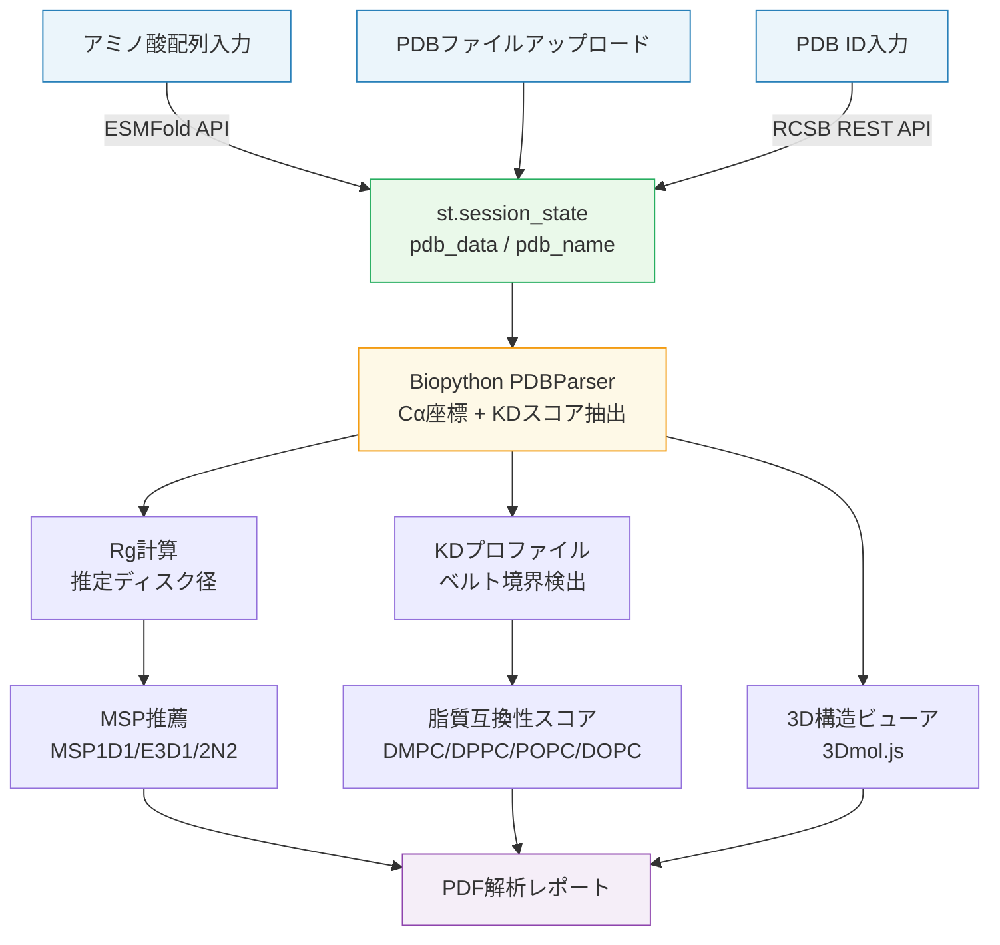

# GPCR-Nanodisc Integration Predictor

GPCRとナノディスクの構造適合性を計算でスクリーニングし、MSPスキャフォールド選択と
脂質互換性スコアをリアルタイムで出力するStreamlit Webアプリ。

---

## 解決した課題

GPCRをナノディスクへ再構成する実験では、適切なMSPスキャフォールドサイズと脂質組成を
「試行錯誤」で決定する必要があった。スキャフォールドが小さすぎればGPCRが収まらず、
脂質の疎水性厚みがベルトと合わなければタンパク質が不安定化する。
誤った組み合わせで再構成を試みると、高価な精製タンパク質が凝集・失活し、
実験コストと時間を大きく消費する。

本ツールは**計算によるウェットラボ前スクリーニング**を可能にする。
アミノ酸配列・PDBファイル・PDB IDのいずれかを入力するだけで、
Radius of Gyrationによるスキャフォールドサイズ推定と
Kyte-Doolittleプロファイルによる疎水性ベルト解析を即時実行し、
最適なMSP推薦と脂質互換性スコアを出力する。

---

## 主要機能

- **3経路の構造入力** — アミノ酸配列入力（ESMFold API予測）・PDBファイルアップロード・
  RCSB REST APIによるPDB IDフェッチに対応
- **Rg解析によるMSP推薦** — Cα座標から回転半径を計算し、推定ディスク径に基づいて
  MSP1D1 / MSP1E3D1 / MSP2N2を自動選択
- **Kyte-Doolittle疎水性ベルト検出** — Z軸に沿ったKDスコアプロファイルに
  移動平均スムージングを適用し、膜貫通ベルト境界を自動同定
- **脂質互換性スコア（0–1）** — ベルト幅と選択脂質二重層厚さの差を正規化した
  互換性スコアをDMPC / DPPC / POPC / DOPCの4種について算出
- **インタラクティブ3D表示 + PDFレポート** — py3Dmolによる膜ベルトボックスオーバーレイ付き
  構造表示と、全指標と疎水性プロファイルを含むPDFエクスポート

---

## Live Demo

Streamlit Cloud にデプロイ済みのため、インストール不要で動作確認できます。

🚀 **[Live Demo](https://gpcr-nanodisc-predictor-dkjrw56qouw7qkqxywnrxr.streamlit.app/)**

PDB ID入力モードで `2RH1`（β2アドレナリン受容体）を試すと、MSP1D1 / MSP1E3D1 の推奨と
POPC に対する脂質互換性スコアが約30秒で出力されます。

---

## 技術スタック

| カテゴリ | 使用技術 |
|---|---|
| 構造取得 | ESMFold API（配列 → 3D構造予測）、RCSB REST API（PDB IDフェッチ） |
| バイオインフォマティクス | Biopython `PDBParser`（Cα座標抽出・残基認識）、Kyte-Doolittleスケール |
| 数値解析 | NumPy（Rg計算・移動平均スムージング・ベルト境界検出） |
| 可視化 | Matplotlib（疎水性プロファイル）、3Dmol.js via `components.v1.html()`（3D構造ビューア） |
| レポート出力 | fpdf（PDFレポート自動生成） |
| Web UI | Streamlit — session_stateによるPDBデータ保持・サイドバー入力管理 |

---

## アーキテクチャ



### ファイル別役割

| ファイル | 役割 |
|---|---|
| `app.py` | 全処理を単一ファイルに集約（495行）。構造取得・Rg解析・KDプロファイル・MSP推薦・3D表示・PDF生成・Streamlit UI |
| `requirements.txt` | 依存ライブラリ（streamlit / biopython / matplotlib / requests / numpy / fpdf） |
| `docs/scientific_basis.md` | 科学的根拠の詳細（Rg推定式の導出、脂質厚さテーブル、参考文献） |

---

## 使用方法

### セットアップ

```bash
git clone https://github.com/TSUBAKI0531/gpcr-nanodisc-predictor.git
cd gpcr-nanodisc-predictor
pip install -r requirements.txt
streamlit run app.py
# → http://localhost:8501
```

### クイックテスト（PDB IDから実行）

1. サイドバーの **Input Method** で `Enter PDB ID` を選択
2. `2RH1`（β2アドレナリン受容体）を入力して **Fetch PDB** をクリック
3. **Target Lipid** で `POPC (Standard)` を選択
4. 解析結果（Rg、Belt Width、互換性スコア、推奨MSP）を確認
5. **Download Analysis Report (PDF)** でレポートをエクスポート

### ESMFold予測から実行

1. サイドバーで `Paste Sequence (ESMFold)` を選択
2. 一文字アミノ酸コードで配列を貼り付け（FASTAヘッダー不要）
3. **Predict Structure** をクリック（APIレスポンス最大180秒）

### 解析フロー全体

```
構造入力（配列 / PDB / ID）
 ↓ 構造取得
脂質選択（Lipid Settings）+ スムージング調整（Advanced Settings）
 ↓ 解析実行（自動）
Analysis Results: Rg / Belt Width / Score / Est. Diameter / 推奨MSP
 ↓
3D Visualization: 膜ベルトボックスオーバーレイ確認
 ↓
Hydrophobic Profile: Z軸KDスコアグラフ確認
 ↓
Download Analysis Report (PDF)
```

---

## 設計上の工夫

**RCSB REST APIによるリアルタイム構造取得**
`fetch_pdb_by_id()` は `https://files.rcsb.org/download/{ID}.pdb` にGETリクエストを送り、PDBファイルをテキストとして取得する。PDB ID不正・構造未存在・ネットワークエラーのいずれも `requests.RequestException` でまとめてハンドルし、`st.error()` でユーザーへ明示する。

**dataclassによる解析結果の型安全な受け渡し**
`ProfileData`（Z座標・疎水性・ベルト境界）と `AnalysisResult`（Rg・ベルト幅・プロファイル・Cα座標・有効フラグ）の2つのdataclassで解析の入出力を型安全に定義している。他リポジトリ（Tissue-Spatial-Analysis・intrabody-design-platform）と一貫したdataclass活用方針。

**session_stateによるAPIコール分離**
`st.session_state` に `pdb_data`・`pdb_name` を保持することで、脂質選択やスムージングウィンドウ変更によるUI再描画時にESMFold APIやRCSB APIへの再リクエストが発生しない。重いAPIコールはユーザーの明示的なボタン操作時のみ実行される。

**3Dmol.jsの直接HTML埋め込み**
`streamlit.components.v1.html()` でpy3Dmolの3Dmol.jsをCDNから直接ロードし、骨格線（backbone N原子）の有無に応じてcartoon / sphere+stickをフォールバック切り替えする。stmolライブラリはStreamlit Cloud依存環境との互換性問題が生じるため、HTML直接埋め込み方式を採用している（intrabody-design-platformと共通のアプローチ）。

**Streamlit Cloudデプロイにおけるイテレーティブ改善**
デプロイ環境での動作確認を通じ、セッション管理・3Dビューア互換性・APIタイムアウト設定など複数の実環境依存バグを修正した。ESMFoldのタイムアウトを `ESMFOLD_TIMEOUT_SEC = 180` として定数化し、長時間リクエストへの対応を明示している。

---

## 今後の拡張可能性

- **膜配向の自動補正** — 現在は構造のZ軸を膜貫通方向と仮定。OPMデータベースとの連携でアップロードPDBを自動配向し、ベルト検出精度を向上
- **マルチチェーン対応** — GPCR-Gタンパク質複合体等の多鎖構造に対してチェーン別解析と複合体全体のディスク径推定に拡張
- **脂質組成の拡張** — コレステロール含有の非対称二重層やPEG化脂質を考慮したより現実的な互換性スコアへ
- **実験値ベンチマーク** — 実験的に検証されたGPCR-Nanodiscペアとの照合によりRg→径変換係数（現在: 2.5）のキャリブレーション

---

## Scientific Basis

本ツールが採用するRadius of Gyrationによるスキャフォールドサイズ推定式、
Kyte-Doolittleスケールを用いた疎水性ベルト検出、脂質二重層厚さ参照値の科学的根拠は
[`docs/scientific_basis.md`](docs/scientific_basis.md) に詳述しています。
参考文献を含む算出根拠を確認したい場合はそちらをご参照ください。

---

## ライセンス

MIT License

---

## Author

GitHub: [@TSUBAKI0531](https://github.com/TSUBAKI0531)
